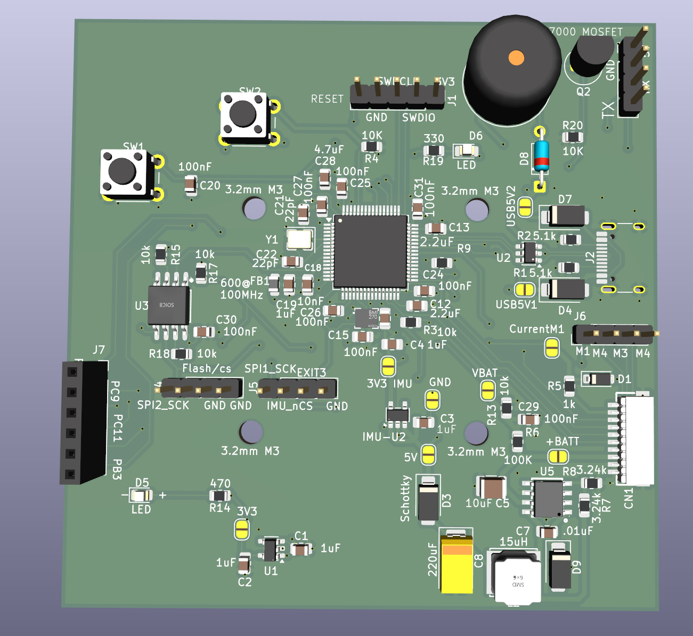

# Custom Drone Flight Controller PCB

## Overview
This project is a custom-designed, STM32-based flight controller for FPV drones, running Betaflight firmware. It is primarily built as a personal engineering challenge to design a complex embedded system from scratch and see it successfully operate in the real world.

Currently a work in progress (WIP), this board is designed as a bench/resume project. It focuses on core flight controller functionalities without video system peripherals (no VTX, camera, or OSD) to prioritize power architecture, IMU integration, and MCU logic.

## Why This Approach?
- **Component Availability and Cost Optimization:** Supply chain realities require flexibility. The entire TDK InvenSense 426xx family became unobtainable in single quantities. By utilizing a dual-LDO power architecture (two distinct 3.3V LDOs: AP2112K and TLV733P), I was able to strictly isolate the noisy logic rails from the sensitive IMU power rail. Designing for rail isolation up front meant a forced sourcing change to the Bosch BMI270 cost only a footprint and a re-route, not a power redesign—VDD still sits on the dedicated quiet TLV733P rail and VDDIO still sits on the main AP2112K logic rail.
- **Real-World Constraints:** I chose to design the flight controller to mate directly with a pre-existing ESC (the Flycolor Raptor BLS-04 4-in-1). This introduced unique constraints, such as the lack of an onboard BEC on the ESC, which required engineering an onboard power buck converter (TPS5450) directly from the raw LiPo voltage.
- **Industry Standard Hardware:** Utilizing the STM32F405 MCU provides native Betaflight support, which requires writing a custom Betaflight target configuration file—a highly relevant exercise in embedded systems development.
- **Self-Assembly:** Designed as an oversized (~60x60mm) bench board with single-sided SMD components to allow for complete self-reflow and hand assembly.

## Hardware Specifications

### MCU & Core Logic
- **Microcontroller:** STM32F405RGT6 (168MHz Cortex-M4 with FPU)
- **Firmware:** Betaflight (Custom target `ETHANF405`)
- **Blackbox:** BOYAMICRO BY25Q128ES (16MB SPI NOR Flash), a cost-effective Betaflight-supported drop-in for the Winbond W25Q128 in a SOIC-8 208-mil package.

### Sensors
- **IMU:** Bosch BMI270 (SPI1, Betaflight gyro define `BMI270`), mounted dead-center for optimal flight dynamics. Required a new footprint and different decoupling (100nF VDD/VDDIO vs. 2.2µF/0.1µF/10nF) compared to the original 42605, but zero power redesign.

### Power Architecture
- **Input:** 4S LiPo (14.8V nominal, 16.8V max) passed through the ESC harness. Relaxed input targets allowed 15µH buck output inductor and 25V input caps (50V still used for transient margin).
- **Onboard Buck:** TPS5450DDAR stepping raw VBAT down to 5V/5A, a pin-for-pin drop-in for the out-of-stock TPS5430.
- **Regulators:**
  - Main 3.3V LDO (AP2112K-3.3) for the MCU, flash, LED, logic, and IMU digital I/O (`VDDIO`).
  - Dedicated quiet 3.3V LDO (TLV733P-3.3) purely for the IMU sensor rail (`VDD`), ensuring minimal switching noise.

### Interfaces
- **ESC Connection:** 10-pin JST SH1.0 harness (mating to Flycolor Raptor BLS-04)
- **Receiver:** FlySky FS-iA6B over i-BUS (UART1)
- **USB:** USB-C for Betaflight configurator and DFU flashing
- **Expansion:** Spare UART3, USART6, I2C1 pads for future GPS/Mag integration

## Design for Bring-Up
- **Staged power isolation:** normally-open solder jumpers split the power tree at four points — buck 5V output to the rest of the 5V rail, 5V to each of the two LDOs, and the quiet 3.3V rail to the IMU. Each stage is brought up and verified on a current-limited bench supply before the next jumper is closed, so a fault in one stage cannot propagate downstream.
- **Test points** on every rail (VBAT, 5V, 3.3V, 3.3V_IMU) plus multiple grounds, the buck switch node and feedback node for scoping, and both ADC sense lines for calibration. Dedicated ground loops near the buck and IMU for short scope-ground connections.
- **Spare GPIO broken out:** all 16 unused STM32 pins are routed to a labelled header, including timer-capable pins for motor reassignment, a spare UART, spare ADC channels, and SWO — insurance against a pin-level mistake requiring a full respin.

## Notable Design Details
- **Motor output DMA conflict:** motor 4 was moved from PB7 to PB5 (TIM3_CH2) to clear a DMA1 Stream 3 collision with SPI2_RX (the blackbox flash). Final motor mapping is M1=PB0, M2=PB1, M3=PB6 (TIM4_CH1), M4=PB5 (TIM3_CH2), verified against RM0090's DMA request mapping table.
- **Buck output capacitor:** a Panasonic POSCAP 10TPB220M (220µF, 10V, 40mΩ ESR) — the exact part named in TI's datasheet worked example. A pure-ceramic output would have too little ESR and risks loop instability, since the TPS545x is internally compensated assuming some output-cap ESR.
- **ADC input protection:** the ESC current-sense line is clamped with a 1kΩ series resistor and a 3.3V zener to protect the STM32 ADC pin.

## Current Status
**Boards ordered from JLCPCB on 2026-07-19 — awaiting delivery (~2 weeks).**

- Schematic and PCB layout complete; **ERC and DRC both clean**.
- 4-layer stackup: L1 signal/components, L2 solid ground, L3 power pours, L4 signal. All SMD on the top layer for a single hotplate reflow pass.
- Ordered as bare 4-layer boards (ENIG finish, chosen for reliable soldering of the LGA gyro and fine-pitch parts) plus a frameless top-side stencil, quantity 5.
- Next step is assembly and staged bring-up once boards arrive.

## Build Instructions
*(To be detailed upon board completion)*
1. **PCB Assembly:** Bare 4-layer boards and stencil ordered. Will apply leaded paste and use a hotplate for single-sided SMD reflow.
2. **Bring-up:** Staged-jumper bring-up sequence: each stage of power isolation (buck 5V, 5V to LDOs, 3.3V to IMU) verified on a current-limited bench supply before closing the next jumper. Then perform rail smoke tests before connecting the MCU via SWD to flash the custom Betaflight target.
3. **Integration:** Connect the verified ESC harness, perform motor spin tests (props off), and calibrate ADC scales for voltage and current.
