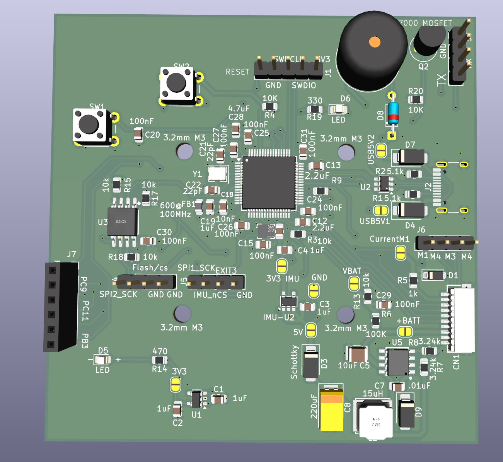

# Custom Drone Flight Controller PCB

An 80×80 mm STM32F405 flight controller for a 4S freestyle quad, running Betaflight off a custom target I wrote. I built it to find out whether I could take an embedded system from a blank schematic all the way to something that actually flies.

Boards are at JLCPCB. Nothing has been powered on yet, so treat everything below as designed-and-verified-on-paper, not proven.

There's no VTX, camera, or OSD. Those are solved problems, and adding them would have cost layout time I wanted to spend on power architecture, IMU integration, and getting the pinout right.

## Why it looks like this

The biggest constraint was self-imposed: the board has to mate with an ESC I already owned, a Flycolor Raptor BLS-04 4-in-1, using its existing 10-pin harness. That turned out to be the most useful decision I made, because the BLS-04 has no BEC. It hands you raw pack voltage and nothing else. So the board needs its own buck converter running off 16.8 V, which is a much more interesting problem than accepting a regulated 5 V from somewhere else.

The board is oversized on purpose. 80×80 mm with a standard 30.5 mm mounting pattern means it overhangs the stack, which would be silly on a real build. But everything is on the top layer in one hotplate reflow pass, and I hand-place all of it, so the extra room is worth more to me than the elegance.

The STM32F405 was the easy call — native Betaflight support, and writing the custom target is a big chunk of the point.

## Hardware

- MCU: STM32F405RGT6, 168 MHz Cortex-M4F, LQFP-64
- IMU: Bosch BMI270 on SPI1
- Blackbox: GigaDevice GD25Q16E, 2 MB SPI NOR on SPI2
- Input: 4S LiPo, 14.8 V nominal / 16.8 V charged, through the ESC harness
- Buck: TPS5450DDAR, VBAT to 5 V
- Regulators: AP2112K-3.3 for MCU/flash/logic and the IMU's VDDIO; TLV733P-3.3 as a separate quiet rail feeding only the IMU's VDD
- Receiver: FlySky FS-iA6B on i-BUS into UART1
- USB-C for Configurator and DFU
- 4-layer: signal / solid ground / power / signal, ENIG finish
- Spare UART3, USART6 and I2C1 pads for GPS or a mag later

## The parts that went wrong

This is the section I'd actually want to talk about in an interview.

**The IMU disappeared mid-design.** I'd settled on a TDK ICM-42605. Then the entire 426xx family went reel-only at LCSC — minimum orders of a thousand-plus — and out of stock at DigiKey and Mouser. In single quantities it simply stopped existing. The replacement was a Bosch BMI270, which shares the 2.5×3.0 mm LGA-14 outline and nothing else: completely different pinout, new footprint, every IMU net re-routed, different decoupling.

What saved it was a decision I'd made months earlier for unrelated reasons. Splitting the 3.3 V rail in two — a main AP2112K for logic and a dedicated TLV733P for the gyro — meant VDD was already isolated from switching noise. When the part changed, VDD still landed on the quiet rail and VDDIO still landed on the logic rail. A forced sourcing change cost me a footprint and a re-route instead of a power redesign. I'd like to claim I planned for that. I didn't.

The tradeoff is real, though: the BMI270 ships uncalibrated, which is why Betaflight discourages it for new designs, and it caps the PID loop at 3.2 kHz instead of 8 kHz. For Acro freestyle neither matters much. It's still a downgrade I took because the alternative was not building the board.

**I ordered the wrong flash chip.** The BOM called for a 128 Mbit part. A 16 Mbit part arrived — 2 MB instead of 16. I found it a week after the boards shipped, while cross-checking three different BOM files against the firmware, which is a sentence that should tell you something about how I was managing the BOM.

I'm keeping it. Betaflight identifies SPI NOR by JEDEC ID at runtime, and the GD25Q16E is already in the driver's device table, so nothing changes in firmware. What I lose is log duration: about 22 seconds at full rate, or roughly 90 seconds if I drop the blackbox sample rate to 1/4. Since 800 Hz still resolves everything below 400 Hz, where the noise peaks that matter for filter tuning live, and since tuning runs are a minute anyway, the practical cost is that I can't log a whole pack. Every candidate chip shares the same SOIC-8 208-mil footprint, so fixing it later is a hot-air swap.

**A DMA collision moved a motor output.** Motor 4 originally sat on PB7, which wanted DMA1 Stream 3 — the same stream SPI2_RX uses for the blackbox flash. DShot would have fought the logger for it. The final as-built mapping is M1 = PB0 and M2 = PB1 on TIM3, M3 = PA3 and M4 = PB10 on TIM2, checked against RM0090's DMA request mapping table. I'll confirm it with `dma show all` at bring-up rather than trusting the table twice.

## Designed so I can actually bring it up

I assume I've made mistakes I haven't found yet, so the board is built to fail safely and be diagnosed.

Four normally-open solder jumpers split the power tree: buck output to the 5 V rail, 5 V to each LDO, and the quiet 3.3 V rail to the IMU. Each stage comes up on a current-limited bench supply before the next jumper is closed, so a short behind one jumper can't take the STM32 with it.

Test points sit on every rail plus multiple grounds, on the buck's switch and feedback nodes for scoping, and on both ADC sense lines for calibration. There are dedicated ground loops next to the buck and the IMU so a scope probe gets a short ground lead instead of the usual six inches of alligator clip.

Unused STM32 pins are broken out to a labelled header where the layout allowed — timer-capable pins for motor reassignment, a spare UART, spare ADC channels, and SWO. Cheap insurance against a pin-level mistake that would otherwise mean a respin.

One more thing that isn't a jumper: the schematic numbers the ESC connector in the reverse order to the manufacturer's diagram. It's only correct if the connector mates flipped. Before anything gets powered, I continuity-beep VBAT and both grounds from the mated cable to the ESC's XT60. Get that wrong and 16.8 V lands on a 3.3 V GPIO.

## Where it's at

Boards ordered from JLCPCB on 2026-07-19, roughly two weeks out. Bare 4-layer with a frameless top-side stencil, quantity 5. ENIG, mostly so the LGA gyro and the fine-pitch parts solder predictably.

Schematic and layout are done, ERC and DRC both clean. The custom Betaflight target builds. Two BOM questions are still open — whether the TPS5450 or the older TPS5430 actually shipped, and whether the buck inductor is the 15 µH the TI worked example calls for or the 22 µH left over from when this was a 6S design. Both get resolved with a multimeter and a magnifier before I populate anything.

## Next

Paste, populate, hotplate. Then staged bring-up through the jumpers, rail smoke tests, SWD in to flash the target, and motor spin tests with props off. Calibrating the voltage and current ADC scales comes last, since neither is knowable until I can measure them.

Then I find out what I got wrong.
